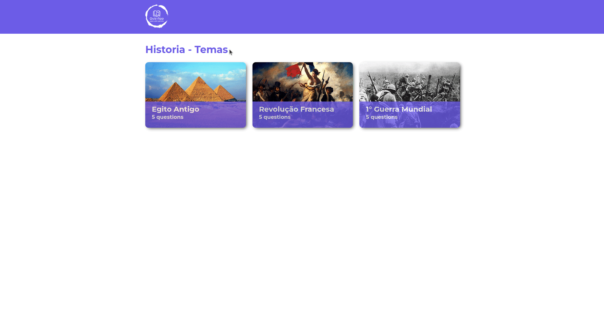

<h1 align="center">
    QuizApp 
</h1>
<h4 align="center">
  A Quiz Frontend Project
</h4>


<p align="center">
  <a href="#computer-features">Features</a>&nbsp;&nbsp;&nbsp;|&nbsp;&nbsp;&nbsp;
  <a href="#rocket-technologies">Technologies</a>&nbsp;&nbsp;&nbsp;|&nbsp;&nbsp;&nbsp;
  <a href="#information_source-how-to-use">How To Use</a>&nbsp;&nbsp;&nbsp;|&nbsp;&nbsp;&nbsp;
  <a href="#memo-license">License</a>
</p>

<p align="center">
    
  Gif with low quality
</p>


## :computer: Features

- Select a theme subject
- Multistep quiz
- Result Page


## :rocket: Technologies

This project was developed to improve my knowledges to become a FullStack Developer and to build this Project I used this technologies:

**FrontEnd**
- [ReactJS](https://reactjs.org/)
- [React Router Dom](https://reactrouter.com/)
- [Typescript](https://www.typescriptlang.org/)
- [Jest](https://jestjs.io/)
- And another bunch of packages....

## :information_source: How to use

To clone and run this application, you'll need [Git](https://git-scm.com), [Node.js][nodejs] + [NPM][npm] installed on your computer or use [docker](https://www.docker.com/) to run a containerized app.

From your command line:

```bash
# Clone this repository
$ git clone https://github.com/IvanildoPereira/quiz-app-react-js.git

# Go into the repository
$ cd quiz-app-react-js
```

```bash
# Install with docker
$ docker build -t quizapp:dev .
$ docker run -it --rm -v "${PWD}:/app" -v /app/node_modules -p 3000:3000 quizapp:dev
```

```bash
# Install using docker-compose
$ docker-compose up -d --build
```

```bash
# Install dependencies for the frontend and run the server on the local machine
$ npm install
$ npm start
```

## :memo: License

This project is under the MIT license.

---

Made with ♥ by Ivanildo Pereira :wave: [Get in touch!](https://www.linkedin.com/in/ivanildopconceicao/)

[nodejs]: https://nodejs.org/
[npm]: https://www.npmjs.com/
